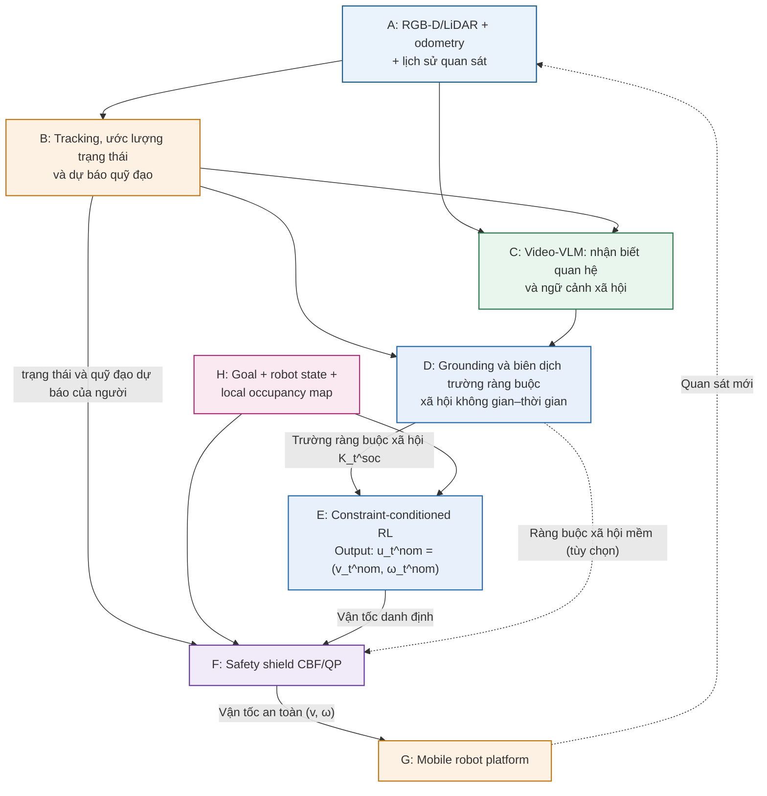

# CLAUDE.md — ninorobot2

Quy tắc làm việc cho Claude trên workspace này. Mục tiêu: giảm những lỗi đã lặp lại
nhiều lần trong quá trình phát triển (sửa nhầm thứ đang chạy được, viết code khi tôi
chỉ hỏi ý kiến, đổi cấu hình môi trường làm sập cả hệ thống, tuyên bố "đã xong" mà
chưa chạy thử).

**Đánh đổi:** các quy tắc này thiên về cẩn trọng hơn là nhanh. Việc nhỏ và rõ ràng
thì dùng phán đoán, không cần theo cứng từng gạch đầu dòng.

---

## Bối cảnh dự án

Robot dịch vụ 2WD (linorobot2 / ROS 2 Humble / Gazebo Classic) điều hướng có nhận
thức xã hội bằng **học tăng cường có điều kiện ràng buộc**. Nav2 không còn nằm trong
vòng điều khiển: policy tự lái từ đầu tới đích.



### Từng khối hiện đang nằm ở đâu trong source

| Khối | Trạng thái | File |
|---|---|---|
| A | xong | URDF `linorobot2_description/urdf/`, world `linorobot2_gazebo/worlds/lirs_test.world` |
| B | 2 nguồn | **train:** ground-truth Gazebo → `social_rl/social_rl/ground_truth.py`. **robot thật:** YOLO+depth → `social_perception/scripts/social_vlm_perception.py` |
| C | **chưa làm** | Video-VLM. Chỗ nối đã có sẵn: trường `scene_type` trong `social_perception/msg/Person.msg`. Code VLM cũ (Qwen2-VL + LoRA nhận diện "đang nói chuyện") đã ngừng dùng, **model đã xoá** |
| D | xong | `social_rl/social_rl/constraint_field.py` |
| E | xong | `social_rl/` — RecurrentPPO + LSTM |
| F | **chưa làm** | Hiện chỉ có `social_navigation/scripts/social_velocity_filter.py` làm vai trò gần giống, KHÔNG phải CBF/QP |
| G | xong | plugin diff_drive (sim) / micro-ROS (thật) |
| H | xong | `social_rl/social_rl/observation.py` — kênh occupancy + vector goal/v/w |

### Luồng dữ liệu lúc train RL

```
Gazebo ──/social_gt/people (pose, vận tốc, facing, scene_type)──┐
   │                                                            ├→ khối D → K_soc (4 kênh)
   └──/model_states (pose robot)────────────────────────────────┘         │
                                                                          ├→ policy → /cmd_vel_safe
   /scan ──→ khối H: occupancy (1 kênh) + goal + v,w ──────────────────────┘
```

**KHÔNG có Nav2, KHÔNG có AMCL, KHÔNG có camera trong vòng lặp.** Vị trí người và vị
trí robot đều lấy từ Gazebo ở frame `world` rồi trừ nhau, nên cả vòng train không
đụng TF.

**Bản đồ thư mục — sửa đúng chỗ:**

| Thư mục | Vai trò | Đụng vào khi |
|---|---|---|
| `social_rl/` | Khối D + E + H. `constraint_field.py`, `observation.py`, `ground_truth.py`, `ros_env.py`, `train.py`, `agent_node.py`, `RUN_RL.txt` | Hình dạng trường ràng buộc, hàm thưởng, siêu tham số, vòng lặp train |
| `linorobot2_gazebo/` | World `lirs_test.world`, plugin `animated_people_release.cpp` (sinh kịch bản + publish ground-truth), `gazebo.launch.py` | Kịch bản người, sensor rate, tốc độ mô phỏng |
| `social_perception/` | Khối B trên robot thật (YOLO+depth), msg `People/Person/Group` | Nhận diện người thật, và sau này là chỗ gắn khối C |
| `social_navigation/` | `SocialLayer` (costmap plugin Nav2), `social_velocity_filter`, model actor | Chỉ khi chạy đường Nav2 cũ để so sánh, hoặc khi làm khối F |
| `linorobot2_navigation/` | Nav2 params, map `cafe_vlm`, rviz | Chỉ khi so sánh RL với Nav2 |
| `linorobot2_description/` | URDF/xacro, mesh | Kích thước robot, vị trí camera/lidar |

**`social_rl/RUN_RL.txt` là nguồn sự thật về cách train RL.**
**`social_navigation/RUN_SCENARIOS.txt` là nguồn sự thật về đường Nav2 cũ.**
Đọc file tương ứng trước khi đề xuất bất kỳ lệnh chạy nào, và cập nhật nó khi luồng
chạy thay đổi.

---

## 1. Hỏi ý kiến ≠ Yêu cầu code

Tôi thường hỏi để **hiểu hệ thống** hoặc để **chọn hướng đi**, không phải để bạn sửa
file ngay. Viết code khi tôi mới đang hỏi là lỗi tốn thời gian nhất từ trước đến giờ.

- Câu hỏi bắt đầu bằng "có phải…", "tại sao…", "…có được không", "…có khả thi không",
  "đưa ra giải pháp/đề xuất/ý kiến" → **chỉ trả lời, không sửa file**.
- Nếu tôi viết rõ "chỉ đưa giải pháp thôi, không cần code" thì tuyệt đối không code,
  kể cả khi bạn thấy sửa rất nhanh.
- Có nhiều hướng thì liệt kê 2–3 hướng kèm đánh đổi (thời gian, rủi ro, ảnh hưởng tới
  robot thật) rồi **khuyến nghị một cái**, đừng tự chọn im lặng.
- Việc lớn: chia thành giai đoạn, làm xong **một giai đoạn thì dừng lại báo cáo**, đợi
  tôi duyệt rồi mới sang giai đoạn sau.
- Không rõ ý tôi thì hỏi lại trước khi sửa, đừng đoán rồi làm rộng ra.
- Ngược lại, khi tôi đã nói "hãy sửa/làm đi" thì làm trọn vẹn, đừng hỏi lại từng bước
  vặt.

## 2. Dùng lại thứ đã có, đừng dựng thêm tầng mới

Stack này đã chạy được. Phần lớn yêu cầu của tôi là **chỉnh cái đang có**, không phải
thêm node/package/lớp trừu tượng mới.

- Trước khi viết node mới: kiểm tra `constraint_field.py`, `ros_env.py`,
  `animated_people_release.cpp`, `social_vlm_perception.py` đã làm được việc đó chưa.
- Tham số điều chỉnh được thì để vào file YAML sẵn có (`rl_train.yaml`,
  `social_vlm_perception.yaml`, `nav_sim.yaml`), không hard-code trong code, cũng
  không đẻ thêm file config mới.
- Không thêm launch argument / cờ / chế độ mà tôi không yêu cầu.
- Không thêm try/except hay fallback cho tình huống không thể xảy ra — nó che mất lỗi
  thật, và lỗi thật ở đây rất khó truy (TF, timestamp, thứ tự khởi động).
- Script dùng một lần (đo đạc, kiểm chứng) để trong `$CLAUDE_JOB_DIR/tmp` hoặc `/tmp`,
  đừng commit vào package.
- Tự hỏi: "sửa 20 dòng trong file có sẵn có giải quyết được không?" Nếu có thì đừng
  viết 200 dòng mới.

## 3. Sửa đúng phạm vi — hệ thống này rất dễ vỡ dây chuyền

Một thay đổi nhỏ ngoài phạm vi đã từng làm sập cả phiên chạy (đổi `ROS_DOMAIN_ID`,
tắt EKF, xoá file "thừa"). Chỉ chạm vào thứ liên quan trực tiếp tới yêu cầu.

- **Không xoá** khi chưa được yêu cầu rõ: `social_navigation/models/Male/` (1.8 GB
  mesh actor, plugin cần), thư mục `.git`, map `cafe_vlm`. Thấy thứ nghi là rác thì
  **báo, đừng xoá**.
- **Không tự sửa** `~/.bashrc`, biến môi trường ROS/Gazebo (`ROS_DOMAIN_ID`,
  `ROS_LOCALHOST_ONLY`, `GAZEBO_MODEL_PATH`), hay `.claude/settings*.json`. Muốn đổi
  thì đề xuất và giải thích hậu quả trước.
- Giữ nguyên phong cách file đang sửa (tiếng Anh trong comment code, tiếng Việt trong
  tài liệu vận hành), kể cả khi bạn thích cách khác.
- Đổi cấu hình sim thì phải rà cả bản robot thật, và ngược lại:
  `rl_train.yaml` ↔ `rl_agent.yaml` ↔ `rl_agent_real.yaml`, `nav_sim.yaml` ↔
  `navigation.yaml`. Đã có lần chỉ sửa một bên rồi quên bên kia.
- Chỉ dọn thứ **chính thay đổi của bạn** làm thừa ra (import, biến, tham số). Code
  chết có sẵn thì nêu ra, không tự xoá.
- Kiểm tra: mỗi dòng đã đổi phải truy ngược được về yêu cầu của tôi.

## 4. "Xong" nghĩa là đã chạy và đã nhìn thấy kết quả

Dự án này không có unit test. Bằng chứng duy nhất là **chạy thật rồi đọc log/topic**.
Không được báo "đã sửa xong" khi mới chỉ sửa file.

Chuyển yêu cầu thành tiêu chí kiểm chứng được:

- "Ground-truth sai" → `ros2 topic echo /social_gt/people` phải có đủ `scene_type`,
  `velocity` khác 0 cho người đang đi, và hướng `facing` khớp hình học kịch bản.
- "Trường ràng buộc không đúng" → dựng cùng một hình học với hai `scene_type` khác
  nhau rồi đọc giá trị ở điểm giữa: `talking` phải ra ~1.0, `backs_turned` phải thấp
  hơn hẳn. Đây là phép thử phân biệt cả kiến trúc.
- "Robot vẫn chen vào giữa" → đọc `peak intrusion` trong log cuối mỗi tập, và
  `social/mean_peak_intrusion` trên tensorboard. Không nói cảm tính.
- "Train chậm" → đọc `fps` trong bảng SB3 và `time_elapsed`, so bằng số.
- "Không thấy robot trong RViz" → kiểm tra TF `map → odom → base_footprint` tồn tại,
  rồi mới nói tới hiển thị.

Cách làm:

- Việc nhiều bước thì nêu kế hoạch ngắn dạng `bước → cách kiểm chứng` trước khi làm.
- **Sau khi sửa C++** (`animated_people_release.cpp`, `social_layer.cpp`) bắt buộc
  `colcon build --packages-select <pkg>` rồi `source install/setup.bash`. Workspace
  build bằng `--symlink-install`, nên Python/launch/YAML **có sẵn** thì sửa là ăn
  ngay, nhưng **file mới thêm** vẫn phải build lại mới được cài vào `install/`.
- **Sửa file `.msg` thì phải build lại MỌI package dùng nó** — `social_perception`,
  `social_navigation`, `linorobot2_gazebo`, `social_rl`.
- Trước khi kết luận, đọc log thật: `/home/son/.ros/log/`, output của terminal tôi
  dán vào, `ros2 topic hz|echo`, `nvidia-smi`.
- Không tự ý `killall` gzserver/rviz2 hay tắt tiến trình tôi đang chạy. Muốn khởi động
  lại thì xin phép, trừ khi tôi đã nói "tắt hết đi".
- Sửa xong mà không chạy được (thiếu GPU, tôi đang chạy phiên khác) thì **nói thẳng là
  chưa kiểm chứng** và ghi rõ lệnh để tôi tự chạy.

## 5. Mọi thay đổi phải sống được ở cả sim lẫn robot thật

Mô phỏng chỉ là bước đệm.

- Ground-truth (`social_rl/social_rl/ground_truth.py`) là **thứ duy nhất** trong
  package đọc đại lượng mà robot thật không có. File này **không được** import từ
  `agent_node.py`. Ranh giới đó là thứ giữ cho một policy chạy được ở cả hai nơi.
- Observation phải **giống hệt nhau** dù người đến từ ground-truth hay từ YOLO.
  Chuyển đổi bằng `env.people_source` trong YAML, không bằng `if` rải trong code.
- Không hard-code đường dẫn tuyệt đối kiểu `/home/son/...` vào code/URDF/world — đã
  từng gây lỗi mesh không tìm thấy khi đổi máy. Dùng `get_package_share_directory` /
  `$(find-pkg-share ...)` / biến môi trường.
- Khác biệt sim ↔ thật phải nằm ở **launch argument hoặc file params riêng**
  (`sim:=true/false`, `use_sim_time`, tên topic camera), không nằm ở `if` rải trong
  code.
- Mọi thứ chạy **offline**: `HF_HUB_OFFLINE=1`, `GAZEBO_MODEL_DATABASE_URI=`. Không
  thêm đoạn code cần tải gì đó từ mạng lúc khởi động.
- `ROS_LOCALHOST_ONLY=1` chỉ dùng khi chạy sim một máy. Khi nói tới robot thật thì
  phải nhắc bỏ nó ra, nếu không laptop và robot không thấy nhau.

## 6. Trả lời gọn, đúng ngôn ngữ, đúng độ sâu

Tôi làm việc bằng tiếng Việt và thường cần hiểu **input/output từng khối**, không cần
văn dài.

- Trả lời bằng **tiếng Việt**. Giữ nguyên tên topic/param/file/frame bằng tiếng Anh,
  không dịch (`/social_gt/people`, `base_footprint`, `scene_type`).
- Giải thích một luồng thì đi theo dạng: **khối → input → output**, ngắn gọn, ưu tiên
  bảng hoặc gạch đầu dòng hơn đoạn văn.
- Đưa lệnh chạy thì đưa **lệnh đầy đủ copy-paste được**, kèm thứ tự terminal, và nói
  rõ phải đợi log nào trước khi sang bước sau.
- Nêu con số khi có (step/s, thời gian train, RTF, VRAM) thay vì "nhanh hơn", "nhẹ
  hơn".
- Không tự khen "đã hoàn thiện", "đã tối ưu" khi chưa đo. Chưa chắc thì nói là chưa
  chắc.

---

## Bẫy đã trả giá để biết — đừng lặp lại

Chi tiết đầy đủ và số đo nằm trong `social_rl/RUN_RL.txt` và
`social_navigation/RUN_SCENARIOS.txt`; đây là bản rút gọn để tra nhanh:

**Gazebo / ground-truth**

- **`twist` của actor trong `/model_states` LUÔN BẰNG 0.** Plugin lái actor bằng
  `SetWorldPose(..., false, false)` nên Gazebo không tính vận tốc cho chúng. Đo
  28-08-2026. Vận tốc phải do `animated_people_release.cpp` tự vi phân rồi publish.
- **`/model_states` KHÔNG có header, nên không có timestamp.** Đừng viết kiểm tra độ
  cũ cho nó. Nó publish theo mỗi world update (~93 Hz); nó im tức là mô phỏng đã dừng.
- **Yaw đưa vào `SetWorldPose` KHÔNG phải hướng người nhìn.** Mỗi `.dae` mang một
  phép quay gốc riêng; đo trên cặp actor đã tuning thì `mesh_yaw = facing + pi/2`.
  Ground-truth publish `facing` riêng, đừng đọc ngược lại từ pose.
- **Actor mới phải dùng lại `.dae` đã biết offset.** `walker_2/3` dùng chung skin
  `m_doctor` vì hằng số `root_roll 1.206206` / `root height 0.886948` trong plugin là
  keyframe Hips ĐẦU TIÊN của đúng file đó. Model khác thì actor lún sàn hoặc bay.
- **Không dùng `run_ekf:=false`.** Plugin diff_drive đặt `publish_odom_tf=false`, EKF
  là nguồn duy nhất phát TF `odom → base_footprint`.

**Train RL**

- **Trường ràng buộc và hàm thưởng phải ra từ CÙNG một hàm.** Nếu policy nhìn K_soc
  mà lại bị phạt theo khoảng cách Euclid thì mọi `scene_type` thành đồ trang trí và
  policy không có lý do gì phải đọc chúng. Observation dùng danh sách đã lọc, còn
  reward khi train ground-truth cố ý gọi cùng hàm đó trên danh sách người ĐẦY ĐỦ
  (không nón, không che khuất). Xem `constraint_field.intrusion_at_zones`.
- **Không chọn checkpoint bằng TensorBoard.** TensorBoard chỉ để theo dõi/shortlist;
  phải chạy `--eval` deterministic trên đúng file `.zip`. Chỉ nghiệm thu khi đồng
  thời đạt: `peak_unseen - peak_intrusion < 0.10`, `clear_episodes > 60%`, mean
  closest TRUE `> 0.60 m`, và `none` về đích `> 90%`.
- **Không pause physics giữa các step thì thời gian mô phỏng trôi trong lúc PPO cập
  nhật mạng.** Đo được: step đầu tiên sau lần cập nhật đầu tiên thấy `/odom` cũ
  1.302 s và run chết. `env.pause_between_steps: true` xử lý chuyện này; overshoot đo
  được là **0 ms**.
- **`env.close()` phải unpause lại.** Bỏ quên thì gzserver đứng hình cho mọi thứ chạy
  sau đó, mà triệu chứng là "mọi topic im lặng, không lỗi ở đâu cả".
- **Trần RTF nằm ở `real_time_update_rate`, không phải ở CPU.** Đo 28-08-2026:
  gzserver ăn 232% CPU trên máy 12 nhân còn rảnh 60%. `gz physics -u 0` cho
  **3.65 → 5.57 step/s** khi THU THẬP ROLLOUT, và ground-truth vẫn theo kịp
  (33.4 Hz). Nhưng tính ĐẦU-CUỐI (kể cả lúc PPO cập nhật mạng) chỉ được
  3.9 step/s so với 4.2 của bản cũ — **chưa nhanh hơn**, đổi lại là tính tất
  định. Đừng trích số 5.57 như thể nó là tốc độ train.
- **Khối D không phải nút thắt.** Đo: 3.36 ms mỗi step với 2 người, tức 1.7%
  thời gian ở 5 Hz. Đi tối ưu numpy ở đó là tối ưu nhầm chỗ.
- **ĐÃ THỬ VÀ KHÔNG ĂN THUA:** đặt `always_on: false` cho camera depth để nó chỉ
  render khi có người subscribe. Đo được 90 s so với 92 s cho 512 step — trong khoảng
  nhiễu. Đã hoàn nguyên. Nút thắt không nằm ở camera.
- **Luật "va người → kết thúc tập" đã bỏ (27-08-2026).** Nó biến mọi lần thử men ra
  sau lưng người thành vách vực; run 20260827_013703 học được đường vòng rồi đánh
  mất, 150 tập cuối timeout 100%.
- **`step_penalty` không được vượt `|obstacle_collision_penalty| / max_episode_steps`.**
  Hễ đứng yên đắt hơn đâm tường thì lao vào tường gần nhất thành lối thoát rẻ.
- **Đổi `grid_size` hoặc số phần tử `prediction_times` là đổi kích thước mạng CNN**,
  checkpoint cũ không nạp lại được. `train.py` chặn việc này khi `--resume`.

**Chung**

- Sửa file trong `social_perception/scripts/` mà thấy "không ăn": kiểm tra symlink
  trong `install/`, và kiểm tra xem có đang chạy tiến trình cũ không.
- **Chỉ bật RViz ở một chỗ** — không bật ở hai launch file cùng lúc.

## Git

- Nhánh làm việc: `main`; nhánh chính trên remote: `my-humble`.
- **Chỉ commit/push khi tôi yêu cầu.**
- Không commit `build/`, `install/`, `log/`, `__pycache__/` (đã có trong `.gitignore`
  — đừng gỡ ra).
